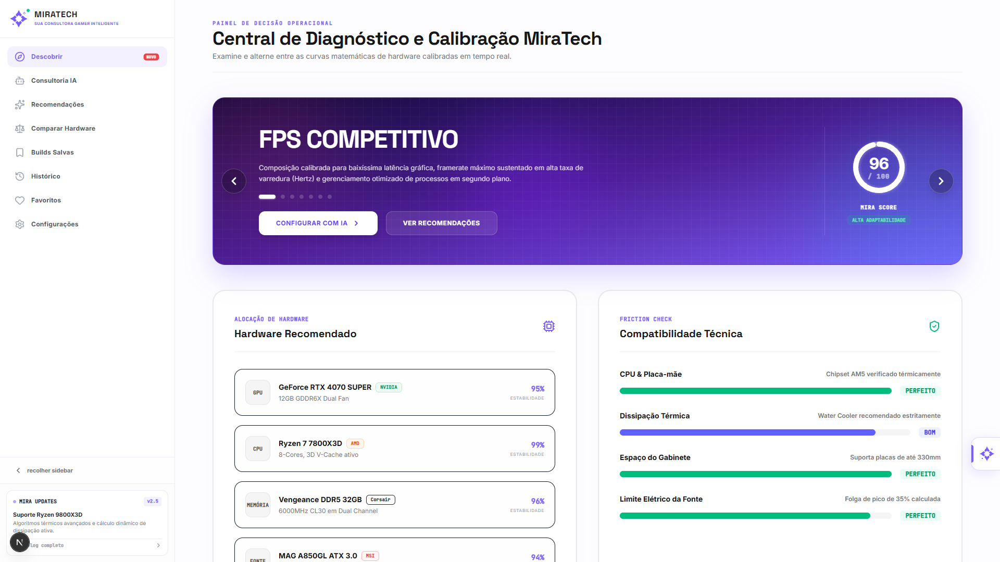

  <h1>✨ MiraTech</h1>
  
<strong>Plataforma Inteligente de Comparação e Montagem de Hardware</strong>

---

> 🚧 **Aviso de Status: Em Construção** 🚧
>
> Este projeto está atualmente em fase de desenvolvimento ativo. Algumas funcionalidades podem estar incompletas, e **existem bugs conhecidos** que estão sendo mapeados e resolvidos. A versão atual não é recomendada para produção.

 

## 📖 Sobre o Escopo do Projeto

A **MiraTech** é uma aplicação voltada para facilitar a vida de entusiastas e profissionais na hora de montar, comparar e analisar peças de computador. Através de um assistente de Inteligência Artificial e busca inteligente, a plataforma ajuda os usuários a encontrar os melhores componentes para o seu orçamento ou necessidade específica (como rodar jogos específicos).

A arquitetura do projeto foi pensada para ser escalável, integrando análises de mercado em tempo real e recomendações personalizadas para evitar gargalos de performance e maximizar o custo-benefício.

### 🌟 Principais Funcionalidades Planejadas

- **Orquestração de Preços:** Buscadores que integram com as principais lojas de varejo para trazer o menor preço.
- **Inteligência Gaming:** Análise de componentes baseada em jogos, indicando se a máquina suporta os títulos desejados.
- **Consultoria via IA (Chat):** Assistente conversacional que ajuda a tirar dúvidas sobre compatibilidade e montagem.
- **Comparador Avançado:** Ferramenta para comparar diferentes peças lado a lado com pontuação de performance.

---

## 🛠 Tecnologias e Arquitetura

O ecossistema do projeto foi construído utilizando tecnologias modernas visando performance e facilidade de manutenção.

**Frontend:**
- [Next.js (App Router)](https://nextjs.org/) - Framework React para renderização Server-side e rotas otimizadas.
- [React 18](https://react.dev/) - Biblioteca para construção de interfaces de usuário.
- [TypeScript](https://www.typescriptlang.org/) - Tipagem estática para maior segurança do código.
- [TailwindCSS](https://tailwindcss.com/) - Framework utilitário de CSS para estilização rápida e responsiva.

**Padrões e Arquitetura:**
- Arquitetura baseada em **Features** e **Serviços**.
- **Adapters Pattern** para busca e scraping de preços em diferentes lojas (ex: KaBuM, Mercado Livre).
- Abstração de Inteligência Artificial com módulos dedicados de recomendação e análise.

---

## 📸 Interface e Capturas de Tela

Confira como o projeto está ficando (Interface em desenvolvimento):

  

 

> *Documentação gerada para apresentação técnica e visão geral da solução arquitetural.*
